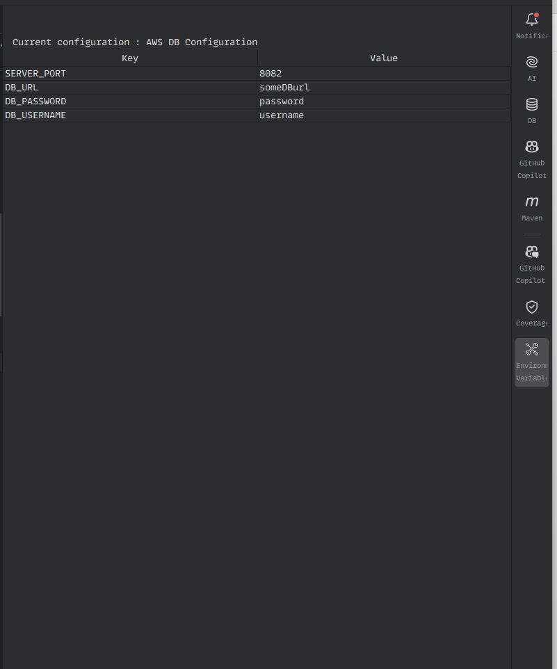

---

# enVar

## Description
This plugin is designed to provide an intuitive interface for managing environment variables in IntelliJ IDEA. Developers often work with multiple run configurations, and as the number of configurations and environment variables grows, it can become challenging to keep track of them all. This plugin simplifies the process by displaying environment variables in a clear, easy-to-read table format and offering a real-time update mechanism.

The plugin aims to reduce the frustration of navigating through complex configurations by providing a central place to view and edit environment variables without needing to open multiple settings windows.

## Why This Plugin Exists
As developers work with multiple run configurations, managing environment variables can become cumbersome, especially when configurations are added or modified frequently. Without a streamlined way to access these variables, developers may lose track of which values are set for each configuration, leading to mistakes, wasted time, and a slower development cycle.

This plugin addresses that problem by:
- Providing a clear interface for managing environment variables.
- Making it easy to view and edit variables associated with any selected run configuration.
- Updating in real-time as you switch configurations, keeping everything in sync.

## Features
- Displays environment variables for the selected run configuration.
- Allows real-time updates of key-value pairs.
- Supports viewing and editing of environment variables.
- Simplified design for quick access and usability.

## Screenshots

## Installation Instructions
1. **Download** the plugin package from the release section.
2. **Open IntelliJ IDEA**, go to **File > Settings > Plugins**.
3. Click on the **gear icon** in the top right and choose **Install Plugin from Disk**.
4. Navigate to the folder where you downloaded the plugin package and select the plugin `.zip` file.
5. Restart IntelliJ IDEA to enable the plugin.

## Usage
1. Open IntelliJ IDEA.
2. Select a **Run Configuration** from the top-right drop-down menu.
3. Open the **Tool Window** from the side panel to view and manage environment variables.
4. The table will display key-value pairs for the current run configuration’s environment variables.
5. Edit the environment variables directly from the table, and the changes will be reflected in the selected run configuration.

## Contributing
If you'd like to contribute to this plugin, feel free to fork the repository and submit a pull request. We welcome contributions that improve functionality, fix bugs, or enhance the user interface.

## License

---
## IntelliJ Plugin - EnVar

EnVar helps manage multiple environment variables across different configurations inside IntelliJ IDEA.

👉 **Download the plugin from JetBrains Marketplace**  
[JetBrains Marketplace - EnVar](https://plugins.jetbrains.com/plugin/26912-envar)

